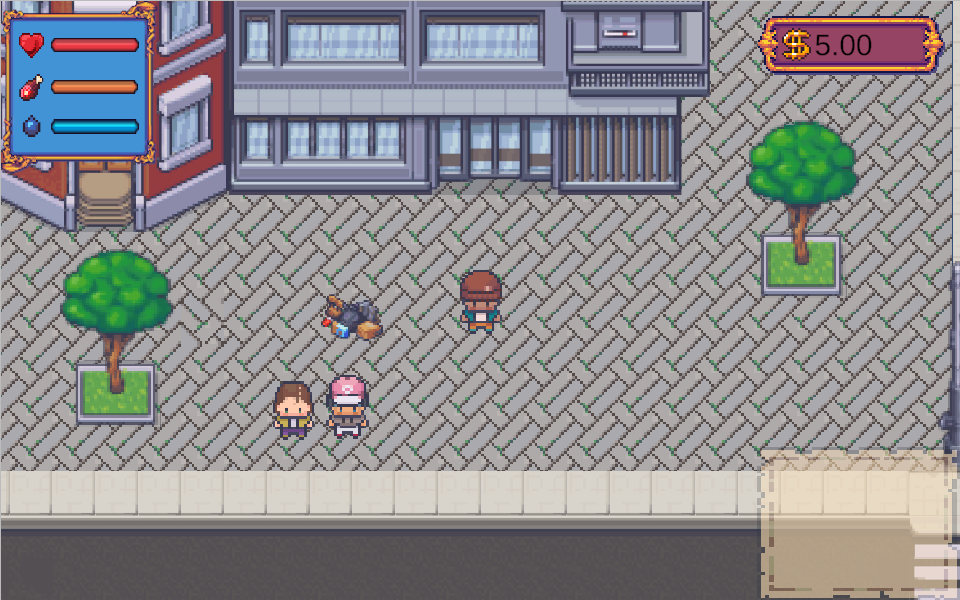
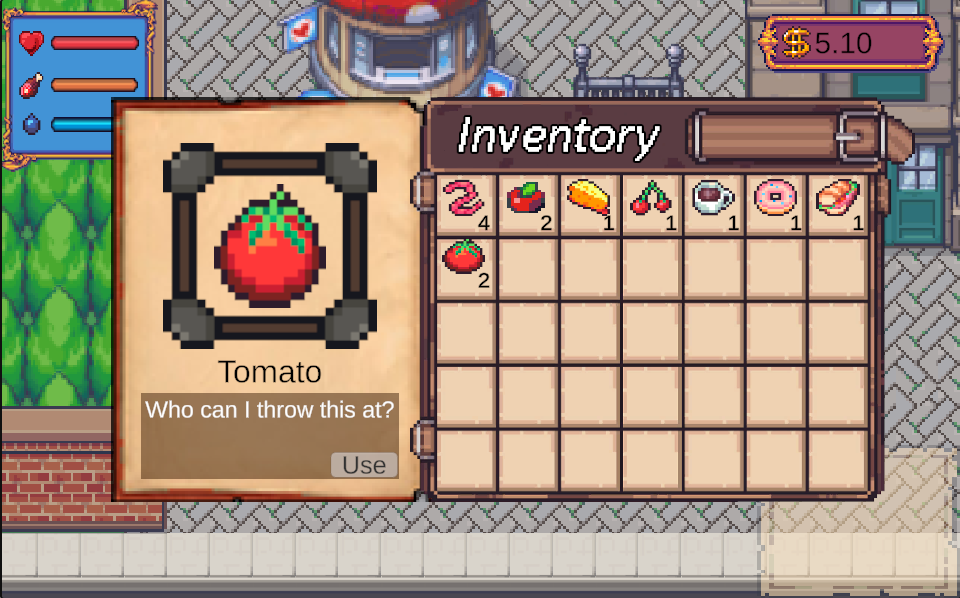
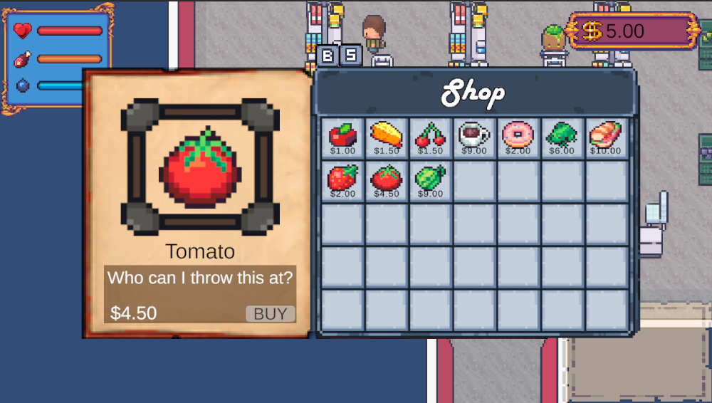
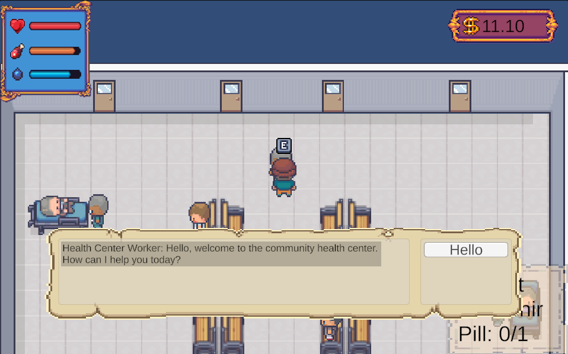
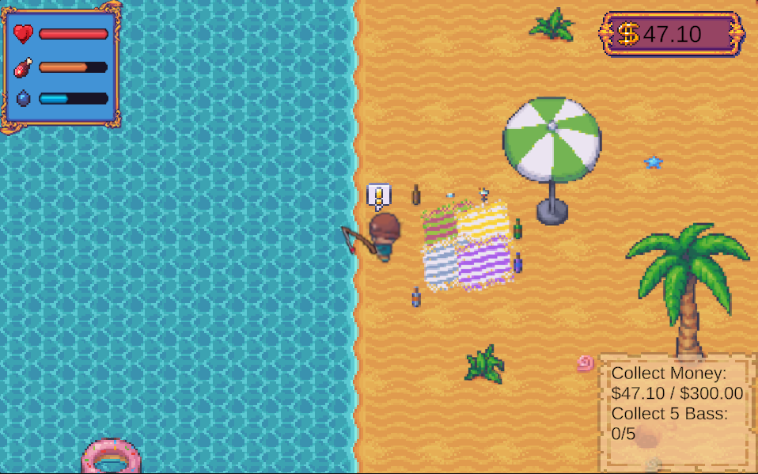
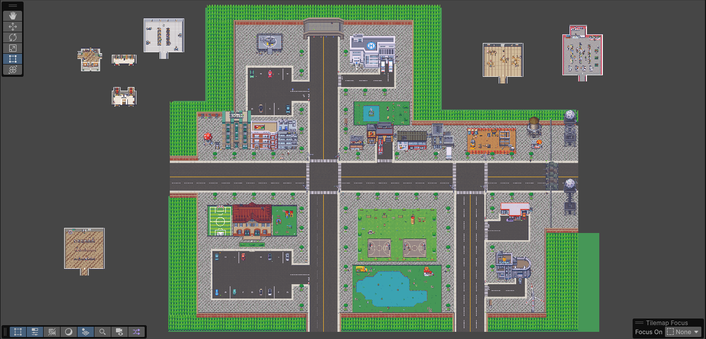
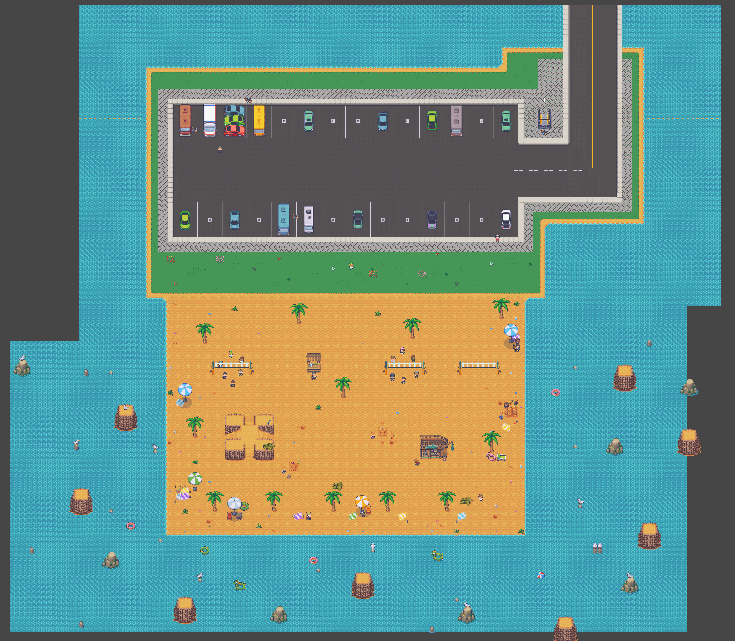

#Concrete Dreams

A top-down 2D video game designed to raise the awareness of homelessness and the available resources that support individuals experiencing homelessness. The game places players in the role of a a person experiencing homelessness as they navigate resources and work toward financial stability. Through exploration, dialogue and simple tasks, the player will explore the city learning about the services that resources like soup kitchens, health centers, homeless shelters, and many more services offer. Alongside learning about available services, players will also discover how to get involved by donating to or volunteering with these organizations, demonstrating how they can make a real impact in their community.

Playable Link:
https://davargas016.itch.io/concretedreams

Credit:

https://limezu.itch.io/ - Interior, Exterior Environment and Character Art

